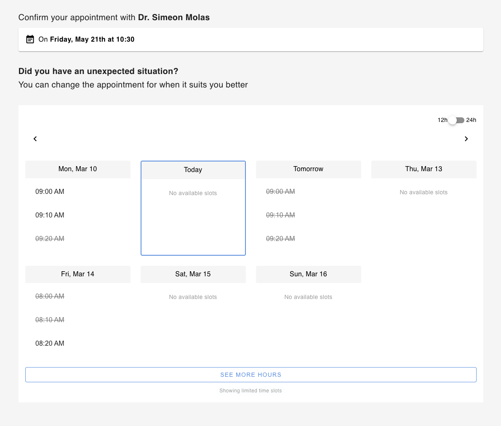
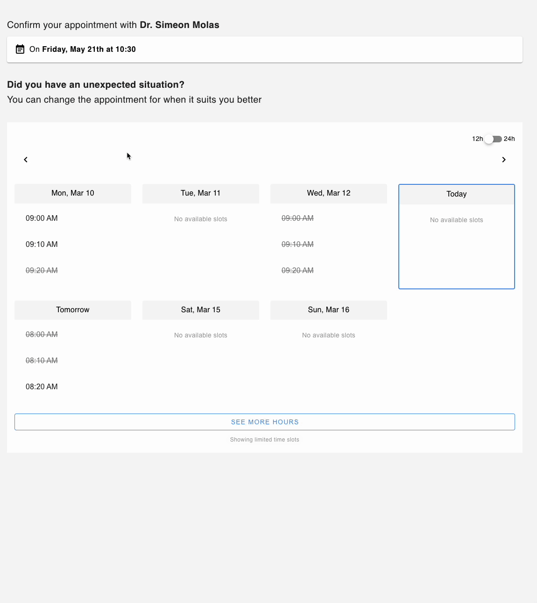

# Medical Appointment Rescheduler

A Vue 3 application that allows patients to reschedule their medical appointments with a simple and intuitive interface.



## Features

- View current appointment details (doctor name and date)
- Browse available slots for the next seven days
- Navigate between weeks to find suitable appointment times
- Select and confirm a new appointment time
- Real-time feedback with loading indicators and error messages
- Responsive design for all device sizes

## Technical Overview

This application is built with modern web technologies and follows best practices for large-scale production applications:

- **Framework**: Vue 3 with Composition API
- **State Management**: Pinia
- **UI Components**: Vuetify 3
- **Type Safety**: TypeScript
- **Build Tool**: Vite
- **Testing**: Vitest and Vue Test Utils

## Project Structure

```
src/
├── assets/           # Static assets like images and styles
├── components/       # Vue components
│   └── __tests__/    # Component tests
├── config/           # Application configuration
├── services/         # API service layer
├── stores/           # Pinia stores for state management
├── types/            # TypeScript type definitions
└── utils/            # Utility functions and helpers
    ├── logger.ts     # Logging utility
    └── errorHandler.ts # Error handling utility
```

## Key Features Implementation

### Appointment Rescheduling

The application allows users to:
1. View their current appointment
2. Browse available slots by date
3. Select a new appointment time
4. Confirm the rescheduling
5. Receive real-time feedback on the process

### Logging System

The application includes a robust logging system that:
- Only logs in development mode
- Provides different log levels (info, warn, error, debug)
- Includes module names and timestamps for better traceability
- Allows creating module-specific loggers

### Error Handling

A comprehensive error handling system that:
- Categorizes errors (API, Network, Validation)
- Provides user-friendly error messages
- Centralizes error handling logic
- Includes detailed error context for debugging

## API Integration

The application integrates with the following API endpoints:

- **GET Weekly Slots**: `https://draliatest.azurewebsites.net/api/availability/GetWeeklySlots/{yyyyMMdd}`
- **POST Book Slot**: `https://draliatest.azurewebsites.net/api/availability/BookSlot`

### Booking Request Format

```json
{
  "Start": "YYYY-MM-DD HH:mm:ss",
  "End": "YYYY-MM-DD HH:mm:ss",
  "Comments": "Additional instructions for the doctor",
  "Patient": {
    "Name": "Patient Name",
    "SecondName": "Patient SecondName",
    "Email": "Patient Email",
    "Phone": "Patient Phone"
  }
}
```

## Getting Started

### Prerequisites

- Node.js (v16+)
- Yarn or npm

### Installation

```bash
# Install dependencies
yarn install

# Start development server
yarn dev

# Build for production
yarn build

# Run tests (unit tests)
yarn test:unit
```

## Development Guidelines

### Code Style

- Use TypeScript for all new code
- Follow the Vue 3 Composition API patterns
- Use Pinia for state management
- Document all functions and components with JSDoc comments

### Error Handling

- Use the centralized error handling utility
- Categorize errors appropriately
- Provide user-friendly error messages
- Log detailed error information for debugging

### Logging

- Use the logging utility for all console output
- Choose the appropriate log level (info, warn, error, debug)
- Include relevant context in log messages
- Only log in development mode

## Preview



## Future Improvements

- Enhance animations
- Improve error handling
- Increase test coverage
- Accessibility improvements
- Offline support
- Analytics integration
